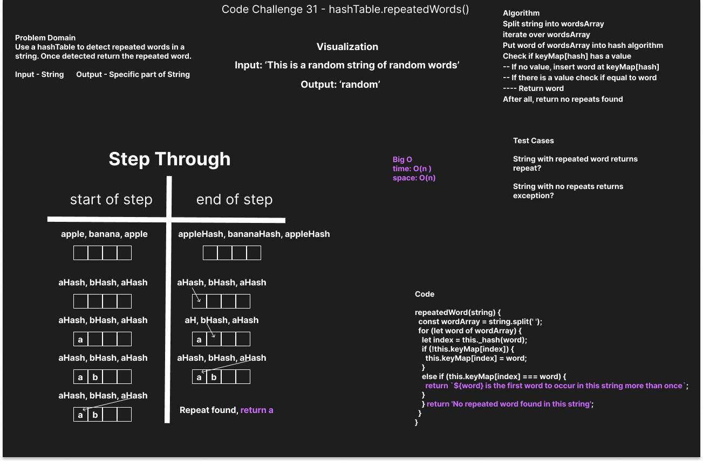

# Hashmap-Repeated-Word

* Write a function called repeated word that finds the first word to occur more than once in a string
* Arguments: string
* Return: string

## Whiteboard Process

## Approach & Efficiency
