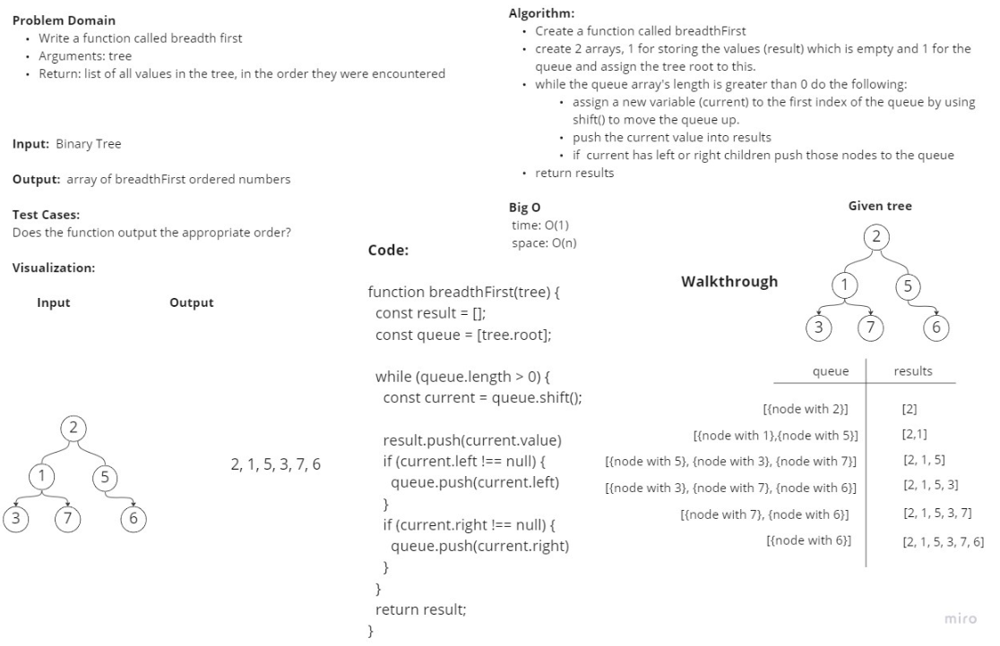

# Tree Breath First

## Challenge

### Feature Tasks

* Write a function called breadth first
* Arguments: tree
* Return: list of all values in the tree, in the order they were encountered

NOTE: Traverse the input tree using a Breadth-first approach

## Approach & Efficiency
<!-- What approach did you take? Why? What is the Big O space/time for this approach? -->

## Whiteboard Process

