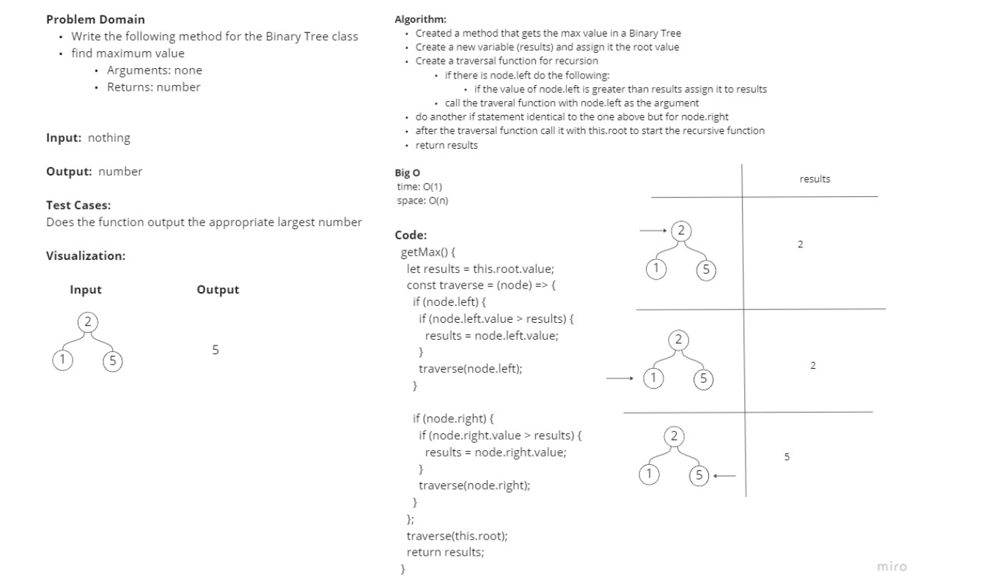

# Tree Max

## Challenge

### Write the following method for the Binary Tree class

* find maximum value
     * Arguments: none
     * Returns: number

Find the maximum value stored in the tree. You can assume that the values stored in the Binary Tree will be numeric.

## Approach & Efficiency
<!-- What approach did you take? Why? What is the Big O space/time for this approach? -->

## Whiteboard Process

